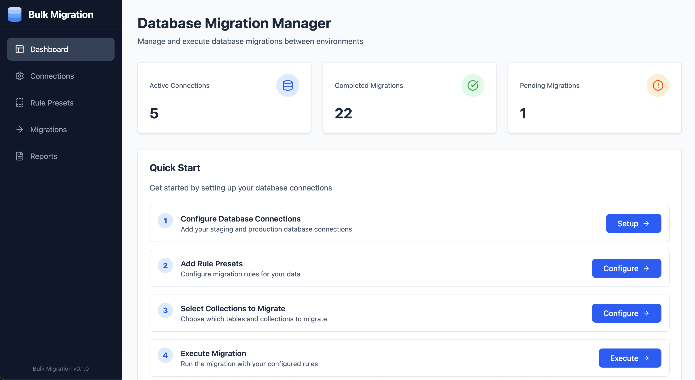

# Bulk Migration

Manage and execute PostgreSQL database migrations between environments with confidence. Configure connections, rule presets, execute, and report migrations.

<h3>Connections, rule presets, execute, and report migrations</h3>
</a>

## 🚀 Features

### Backend (Node.js + Express)
- ✅ Complete REST API
- ✅ PostgreSQL connection management
- ✅ Migration execution with multiple strategies
- ✅ Detailed logging system
- ✅ Reports and statistics

### Frontend (React)
- ✅ Dashboard with statistics
- ✅ Visual connection management
- ✅ Configure Rule presets
- ✅ Migration configuration per collection
- ✅ Modern and responsive interface
- ✅ Report visualization

## 📋 Prerequisites

- Node.js 18+ 
- PostgreSQL 12+
- npm or yarn

### TODO
- ✅ Rollback support (structure ready)


## 🔧 Installation

### 1. Clone the repository

```bash
git clone git@github.com:leandro-jm/bulk-migration.git
cd bulk-migration
```

### 2. Install dependencies

```bash
npm install
```

### 3. Configure environment

Create a `.env` file in the project root:

```env
PORT=3001
NODE_ENV=development
LOG_LEVEL=debug

# Main application database
APP_DB_HOST=localhost
APP_DB_PORT=5432
APP_DB_NAME=bulk_migration
APP_DB_USER=postgres
APP_DB_PASSWORD=postgres
```

### 4. Create the database

```bash
# PostgreSQL CLI
psql -U postgres
CREATE DATABASE bulk_migration;
\q
```

### 5. Start the server

```bash
# Development (with auto-reload)
npm run dev

# Production
npm start
```

The server will be running at `http://localhost:3001`

## 📁 Project Structure

```
bulk-migration/
├── config/
│   ├── database.js          # Database configuration
│   └── logger.js            # Logging system
├── routes/
│   ├── connections.js       # Connection routes
│   ├── migrations.js        # Migration routes
│   └── reports.js           # Report routes
├── services/
│   ├── connectionService.js # Connection logic
│   └── migrationService.js  # Migration logic
├── scripts/
│   ├── setup.sh            # Setup script
│   ├── create-db.sql       # Initial SQL
│   └── test-setup.js       # Setup test
├── logs/                    # Application logs
├── .env                     # Environment variables
├── server.js               # Main server
└── package.json
```

## 🔌 API Endpoints

### Connections

```
GET    /api/connections              # List all connections
POST   /api/connections              # Create new connection
POST   /api/connections/test         # Test a connection
GET    /api/connections/:id/collections  # List collections
DELETE /api/connections/:id          # Remove connection
```

### Migrations

```
GET    /api/migrations               # List all migrations
GET    /api/migrations/:id           # Migration details
POST   /api/migrations/execute       # Execute migration
POST   /api/migrations/:id/rollback  # Perform rollback
```

### Reports

```
GET    /api/reports/stats            # General statistics
GET    /api/reports/:id/export       # Export report
```

## 🎯 Migration Rules

### Schema Only
Migrates only table structure (no data)

### Overwrite (Truncate and Insert)
- Recreates table structure
- Removes all existing data (TRUNCATE)
- Inserts all data from source

### Upsert
- Recreates structure if necessary
- Inserts new records
- Updates existing records (based on primary key)

### Insert Ignore
- Recreates structure if necessary
- Inserts only non-existing records
- Ignores duplicate key errors


## 🔐 Security

⚠️ **IMPORTANT**: In production, you should:

1. **Encrypt passwords in database**
   - Use bcrypt or similar for password hashing
   - Never store passwords in plain text

2. **Add authentication**
   - Implement JWT or sessions
   - Protect all sensitive routes

3. **Input validation**
   - Validate all input data
   - Sanitize SQL queries

4. **Rate limiting**
   - Limit requests per IP/user
   - Prevent DDoS attacks

5. **Mandatory HTTPS**
   - Use SSL certificates
   - Redirect HTTP to HTTPS

## 🐛 Troubleshooting

### PostgreSQL connection error

```bash
# Check if PostgreSQL is running
sudo service postgresql status

# Check credentials in .env
cat .env
```

### Tables are not created

```bash
# Check logs
tail -f logs/combined.log
```

## 📝 Logs

Logs are saved in:
- `logs/error.log` - Errors only
- `logs/combined.log` - All logs

```bash
# View real-time logs
tail -f logs/combined.log

# Filter errors
grep ERROR logs/combined.log
```

## 🚀 Production Deploy

### Using PM2

```bash
npm install -g pm2

# Start the application
pm2 start server.js --name bulk-migration

# Configure auto-restart
pm2 startup
pm2 save
```

### Using Docker

```dockerfile
FROM node:18-alpine

WORKDIR /app
COPY package*.json ./
RUN npm ci --only=production
COPY . .

EXPOSE 3001
CMD ["node", "server.js"]
```

## 🤝 Contributing

1. Fork the project
2. Create a feature branch (`git checkout -b feature/AmazingFeature`)
3. Commit your changes (`git commit -m 'Add some AmazingFeature'`)
4. Push to the branch (`git push origin feature/AmazingFeature`)
5. Open a Pull Request

## 📄 License

This project is under the MIT license.

## 👥 Authors

- Leandro Martins - [@leandro-jm](https://github.com/leandro-jm)
- https://www.linkedin.com/in/leandrojmartins/

## 🙏 Acknowledgments

- No-code tools migrations
- PostgreSQL Community
- Express.js and Knex.js
- Name project inspired in film Interstellar :)

---
